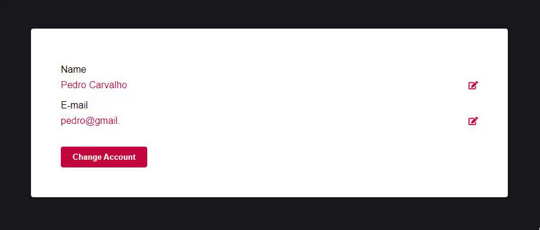

# react-label-editable

React Component to create Field Input/Label that is editable easily.

## Install

```bash
npm i react-label-editable
```

[react-label-editable package](https://www.npmjs.com/package/react-label-editable)

## Example



## Usage

```js | pure 
import LabelEditable from 'react-label-editable';
import React, { useState } from 'react';

export default function FieldEditable(){
  const [ email, changeEmail ] = useState("");

  return (
    <div className="field">
      <label className="label" for="email">E-mail</label>
      <LabelEditable 
        value={email} //value that start label
        onChange={changeEmail} //changing email value
        startWithInput={false} //start with input or label
      />
    </div>
  );
}
```

## CSS EDIT

```css | pure
  .LabelEditable { }   /* Container in the component */

  .LabelEditable .label-editable { } /* Only Label Element */

  .LabelEditable .input-editable { } /* Only Input Element */
```